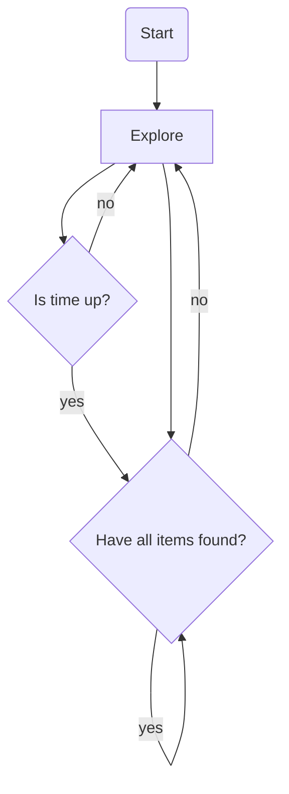
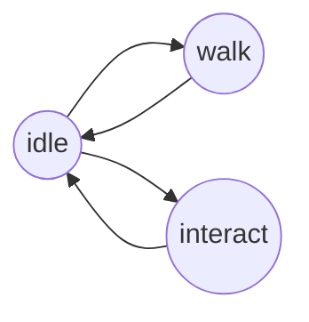

## Sample Scene
Small sample scene with simple narrative structure.

### Content and goals

- [Project planning](###project-planning)
- [Narrative](###narrative-and-characters)
- [Player character](###player-character) 
- [Animations](###animations) 
- Objects
- Metahuman - as interactible component (NPC)
- Player character clothes 
- Inventory system
- Level / Scene 
- UI design and 
- Soundeffects
- Lighting, Particles effects

## Project planning

Next to working on the demo itself planning it was huge and important part.

I created a Miro board to capture my DOD's, milestones outline,gameplay loop and features and states of player, NPC and interactible objects as well as visual inspirations.
<figure>

  <figcaption style="font-weight: bold;">A small capture from the planning board containing a small moodboard for the scene set up and some ideas about iteractable objects</figcaption>
</figure>

Below the gameplay loop is drawn. The player is always in explore state, which terminates only if the time is up or all items to finish the game are found.

The Explore state can be further defined as:

## Narrative and Characters

I tried to create a small narrative around the game. 
The game contains two characters. The player - who is non-human - and an NPC - human - who are captured in a barn. The environment is cold and therefore the human character gets colder and weaker with time. The  player character has to gather items to make a fire and keep the human alive. 
So, the game ends either by death of the NPC character or accomplishment of saving it.

The UE default mannequin *Quinn* fits that narative idea perfectly so I left her as player character. For the human character a MetaHuman is planned to use.

## Animations

### Animation Blueprint
*AnimationInstanceProxy* and *Multi threaded animation*  are features new since UE 5 to optimize animation perfomance. The proxy stores variables necessary for animations to play and adapt (e.g. speed, or certain flags) while thread safe animation outsources animation processing from the game thread onto a seperate thread. To get better understanding of this feature I implemented theproxy in C++.

Other new features since UE 5 are *Linked Anim Graph* and *Animation Interfaces*. I used the first to seperate Locomotion and LookAt logic from the general Anim Graph. The interface was set up to implement Interaction animations which vary only depending on the object the character was interacting with:

### Look at behaviour

When passing an interactible object the player actor turns the head to it's direction when close it.

<figure>

  <figcaption style="font-weight: bold;">UML class diagram showing classes handling the LookAtbehaviour and their relationships </figcaption>
</figure>

The movement of the bones is set up in the **Look** Control rig. The target location is specified with variable **LookAtLocation**  which is set in the **ABP_Base**'s AnimGraph (parent: UBaseAnimInstance). To toggle the head rotation two conditions need to met:
- The player has overlapped the **ALookAtTarget**'s trigger (a object reference will then be stored in a field of the Character)
- The angle of the head rotation needs to be in the specified range (set in the **LOOK_AT_RANGE_OFFSET** variable) 

<figure>

  
  <figcaption style="font-weight: bold;">Left - Set up of Look control rig in ABP_Base; Right - Set up of the head rotation using LookAtLoaction coordinates to manipulate head, neck and spine bones</figcaption>
</figure>

### Move to animation position
To have the character standing in the right position when pressing the Key to interact with an object an *NavMesh* was used to walk the character to the correct position before playing the animation.

    <figcaption style="font-weight: bold;">The E key is pressed while having the character still positioned at some distance from the animation postition. The functionality rotates and walks the character to the right postion and then play the animation.</figcaption>